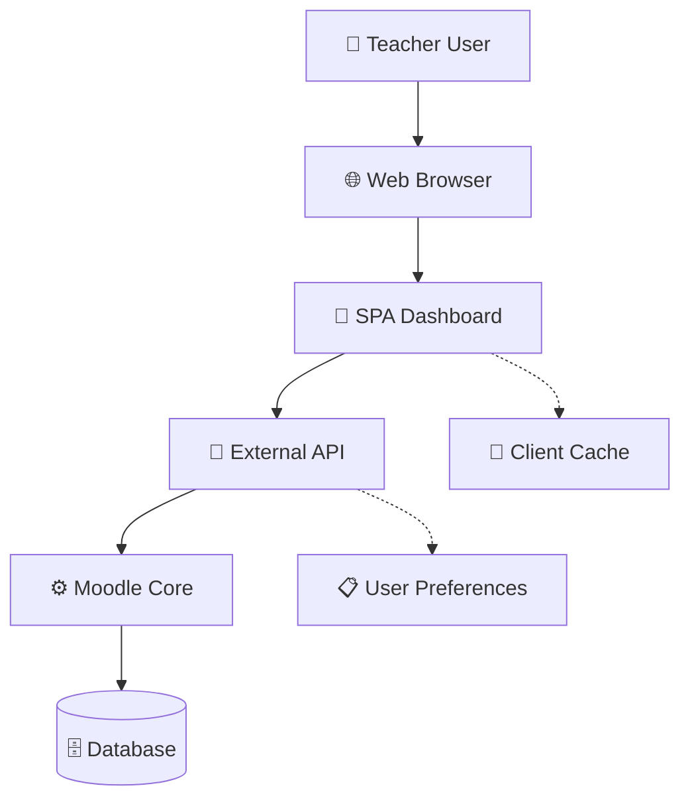
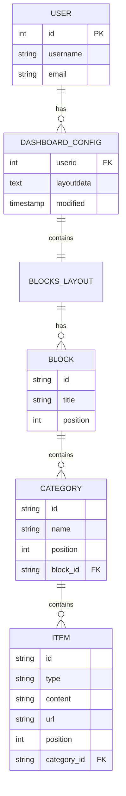
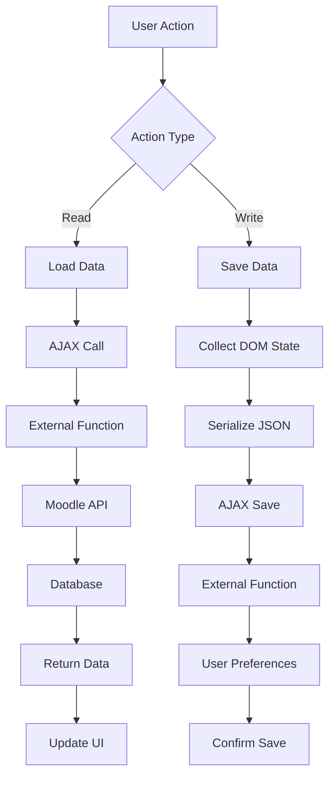

# Architecture Overview - Teacher Dashboard Plugin

## Índice

- [1. Visión General del Sistema](#1-visión-general-del-sistema)
- [2. Principios Arquitectónicos](#2-principios-arquitectónicos)
- [3. Arquitectura de Software](#3-arquitectura-de-software)
  - [3.1 Patrón MVC Adaptado](#31-patrón-mvc-adaptado)
  - [3.2 Separación de Responsabilidades](#32-separación-de-responsabilidades)
  - [3.3 Dependency Injection](#33-dependency-injection)
- [4. Arquitectura de Datos](#4-arquitectura-de-datos)
  - [4.1 Modelo de Datos](#41-modelo-de-datos)
  - [4.2 Flujo de Datos](#42-flujo-de-datos)
  - [4.3 Persistencia](#43-persistencia)
- [5. Arquitectura de Componentes](#5-arquitectura-de-componentes)
  - [5.1 Componentes Frontend](#51-componentes-frontend)
  - [5.2 Componentes Backend](#52-componentes-backend)
  - [5.3 Integración Moodle](#53-integración-moodle)
- [6. Patrones de Diseño](#6-patrones-de-diseño)
- [7. Arquitectura de Seguridad](#7-arquitectura-de-seguridad)
- [8. Arquitectura de Performance](#8-arquitectura-de-performance)
- [9. Decisiones Arquitectónicas](#9-decisiones-arquitectónicas)
- [10. Evolución y Escalabilidad](#10-evolución-y-escalabilidad)

---

## 1. Visión General del Sistema

### 1.1 Descripción Arquitectónica

El Teacher Dashboard Plugin implementa una **arquitectura híbrida client-server** optimizada para el ecosistema Moodle, combinando:

- **Single Page Application (SPA)** para la interfaz de usuario
- **RESTful-like API** usando External Functions de Moodle
- **Event-driven UI** con sistema drag & drop jerárquico
- **Stateful client** con persistencia server-side



### 1.2 Características Arquitectónicas

**Escalabilidad:**
- Configuración por usuario independiente
- Sin impacto en performance global de Moodle
- Cache inteligente de datos de cursos

**Mantenibilidad:**
- Separación clara de responsabilidades
- Código modular y testeable
- Patrones estándar de Moodle

**Usabilidad:**
- Interfaz responsive y moderna
- Feedback visual inmediato
- Persistencia automática

**Integración:**
- APIs nativas de Moodle
- Respeto de sistema de permisos
- Compatible con temas existentes

---

## 2. Principios Arquitectónicos

### 2.1 Principios SOLID

**Single Responsibility Principle:**
```
- Cada External Function tiene un propósito específico
- Componentes JavaScript con responsabilidades únicas
- CSS organizado por funcionalidad
```

**Open/Closed Principle:**
```
- Extensible via nuevos External Functions
- Componentes drag & drop reutilizables
- Sistema de tipos de elementos extensible
```

**Liskov Substitution Principle:**
```
- Interface consistente para todos los elementos draggable
- External Functions intercambiables
```

**Interface Segregation Principle:**
```
- AMD modules con dependencies específicas
- External Functions con parámetros mínimos necesarios
```

**Dependency Inversion Principle:**
```
- Frontend depende de abstractions (Ajax interface)
- Backend depende de Moodle APIs (abstractions)
```

### 2.2 Principios de Clean Architecture

**Independence of Frameworks:**
- Business logic independiente de jQuery/Moodle
- Testeable sin dependencias externas

**Testability:**
- Funciones puras donde es posible
- Mocking capabilities para testing

**Independence of UI:**
- Lógica de negocio separada de presentación
- Multiple presentation layers posibles

### 2.3 Principios de Performance

**Lazy Loading:**
- Datos de cursos cargados asíncronamente
- Configuración cargada on-demand

**Caching Strategy:**
- Cache de elementos DOM
- Cache de datos de cursos
- Debounced operations

**Resource Management:**
- Event delegation para elementos dinámicos
- Cleanup de resources automático

---

## 3. Arquitectura de Software

### 3.1 Patrón MVC Adaptado

**Model Layer (Backend):**
```php
// Data & Business Logic
namespace local_teacher_dashboard\external;

class get_course_data extends external_api {
    // Business logic for course data retrieval
    public static function execute() {
        return CourseDataModel::getUserTeacherCourses();
    }
}
```

**View Layer (Frontend HTML/CSS):**
```html
<!-- Presentation Layer -->
<div id="teacher-dashboard">
    <div class="dashboard-blocks">
        <!-- Visual components -->
    </div>
</div>
```

**Controller Layer (JavaScript AMD):**
```javascript
// User interaction & coordination
define(['jquery', 'core/ajax'], function($, Ajax) {
    function handleUserInteraction() {
        // Coordinate between Model and View
    }
});
```

### 3.2 Separación de Responsabilidades

**Responsabilidades Frontend:**
```
├── Presentation Logic (CSS)
│   ├── Layout & Visual Design
│   ├── Responsive Behavior
│   └── Drag & Drop Visual Feedback
├── Interaction Logic (JavaScript)
│   ├── Event Handling
│   ├── DOM Manipulation
│   └── State Management
└── Communication Logic (AJAX)
    ├── API Calls
    ├── Error Handling
    └── Data Transformation
```

**Responsabilidades Backend:**
```
├── Business Logic (External Functions)
│   ├── Data Validation
│   ├── Business Rules
│   └── Authorization
├── Data Access (Moodle APIs)
│   ├── Course Enrollment Data
│   ├── User Preferences
│   └── Context & Capabilities
└── Integration Logic (Plugin Structure)
    ├── Installation & Upgrades
    ├── Capability Definition
    └── Service Registration
```

### 3.3 Dependency Injection

**AMD Module Dependencies:**
```javascript
define([
    'jquery',           // DOM manipulation
    'core/ajax',        // Moodle AJAX wrapper
    'core/notification' // User notifications (optional)
], function($, Ajax, Notification) {
    // Dependencies injected automatically
});
```

**External Function Dependencies:**
```php
class get_course_data extends external_api {
    public static function execute() {
        global $USER; // Moodle user context
        
        // Dependencies via Moodle APIs
        $courses = enrol_get_users_courses($USER->id);
        $context = context_system::instance();
        
        return process_course_data($courses);
    }
}
```

---

## 4. Arquitectura de Datos

### 4.1 Modelo de Datos

**Entidades Principales:**


**Jerarquía de Datos:**
```
Dashboard
├── User Configuration (JSON in user_preferences)
├── Block 1-4 (Predefined structure)
│   └── Categories (User-defined)
│       └── Items (Courses + Custom Links)
└── Available Items Pool
    ├── Subscribed Courses (Moodle API)
    ├── Available Categories (User-created)
    └── Available Links (User-created)
```

### 4.2 Flujo de Datos

**Data Flow Diagram:**


**Estados de Datos:**
```javascript
// Client-side data states
var dataStates = {
    LOADING: 'loading',
    LOADED: 'loaded',
    SAVING: 'saving',
    SAVED: 'saved',
    ERROR: 'error'
};

// State management
var currentState = {
    courseData: dataStates.LOADING,
    layoutData: dataStates.LOADING,
    autoSave: dataStates.SAVED
};
```

### 4.3 Persistencia

**Estrategia de Persistencia:**
```
├── User Preferences (Moodle core table)
│   ├── Key: 'local_teacher_dashboard_layout'
│   ├── Value: JSON serialized configuration
│   └── Per-user isolated storage
├── Course Data (Moodle core tables)
│   ├── Source: enrol_get_users_courses()
│   ├── Real-time via AJAX
│   └── Read-only for plugin
└── Plugin Metadata (Moodle plugin tables)
    ├── Version info
    ├── Capabilities
    └── External function definitions
```

**Persistencia Pattern:**
```php
// Save pattern
function save_user_layout($layout_data) {
    global $USER;
    
    $serialized = json_encode($layout_data);
    set_user_preference(
        'local_teacher_dashboard_layout', 
        $serialized, 
        $USER->id
    );
}

// Load pattern
function load_user_layout() {
    global $USER;
    
    $serialized = get_user_preference(
        'local_teacher_dashboard_layout', 
        null, 
        $USER->id
    );
    
    return $serialized ? json_decode($serialized, true) : null;
}
```

---

## 5. Arquitectura de Componentes

### 5.1 Componentes Frontend

**Component Hierarchy:**
```
TeacherDashboard (Root Component)
├── DashboardHeader
│   ├── Title
│   └── ActionButtons
│       ├── CreateCategoryButton
│       ├── CreateLinkButton
│       └── SaveConfigButton
├── AvailableItemsSection
│   ├── AvailableCoursesGroup
│   ├── AvailableCategoriesGroup
│   └── AvailableLinksGroup
└── DashboardMain
    └── DashboardBlocks
        ├── DashboardBlock (x4)
        │   ├── BlockHeader
        │   └── BlockContent
        │       └── Category (Dynamic)
        │           ├── CategoryHeader
        │           └── ItemList
        │               └── Item (Dynamic)
```

**Component Responsibilities:**

**TeacherDashboard (Main Controller):**
```javascript
var TeacherDashboard = {
    init: function() {
        this.cacheElements();
        this.setupEventHandlers();
        this.initializeSubComponents();
    },
    
    cacheElements: function() {
        // Cache DOM references
    },
    
    setupEventHandlers: function() {
        // Global event delegation
    },
    
    initializeSubComponents: function() {
        DragDropSystem.init();
        ConfigurationManager.init();
        AjaxManager.init();
    }
};
```

**DragDropSystem (Specialized Component):**
```javascript
var DragDropSystem = {
    draggedElement: null,
    dragType: null,
    
    init: function() {
        this.setupDragHandlers();
        this.setupDropZones();
        this.setupValidation();
    },
    
    validateDropOperation: function(source, target) {
        // Hierarchical validation logic
    }
};
```

### 5.2 Componentes Backend

**External Function Architecture:**
```
ExternalAPIBase (Abstract Pattern)
├── GetCourseData
│   ├── Validation Logic
│   ├── Business Logic (Course filtering)
│   └── Response Formatting
├── SaveLayout
│   ├── Input Validation
│   ├── Data Sanitization
│   └── Persistence Logic
└── GetLayout
    ├── Access Control
    ├── Data Retrieval
    └── Response Formatting
```

**Service Layer Pattern:**
```php
// Abstract base for consistent API
abstract class DashboardExternalBase extends external_api {
    
    protected static function validate_user_access() {
        $context = context_system::instance();
        self::validate_context($context);
        require_capability('local/teacher_dashboard:view', $context);
    }
    
    protected static function validate_teacher_role() {
        // Common teacher validation logic
    }
    
    protected static function format_error_response($message) {
        // Standardized error responses
    }
}
```

### 5.3 Integración Moodle

**Plugin Integration Points:**
```
Moodle Core Integration
├── Authentication Layer
│   ├── require_login()
│   ├── context_system::instance()
│   └── require_capability()
├── Data Access Layer
│   ├── enrol_get_users_courses()
│   ├── get_user_preference()
│   └── set_user_preference()
├── UI Integration Layer
│   ├── $OUTPUT->header()
│   ├── get_string() internationalization
│   └── $PAGE->requires->js_call_amd()
└── Security Layer
    ├── external_api validation
    ├── clean_param() sanitization
    └── has_capability() authorization
```

**Moodle API Wrapper Pattern:**
```php
class MoodleAPIWrapper {
    
    public static function getUserCourses($userid) {
        $courses = enrol_get_users_courses($userid, true);
        return array_filter($courses, function($course) {
            return self::isUserTeacher($course);
        });
    }
    
    private static function isUserTeacher($course) {
        $context = context_course::instance($course->id);
        return has_capability('mod/assign:grade', $context) ||
               has_capability('moodle/course:manageactivities', $context);
    }
}
```

---

## 6. Patrones de Diseño

### 6.1 Creational Patterns

**Singleton Pattern (AMD Module):**
```javascript
define(['jquery'], function($) {
    var instance = null;
    
    function DashboardSingleton() {
        if (instance !== null) {
            return instance;
        }
        
        instance = this;
        this.initialized = false;
        
        return instance;
    }
    
    return {
        getInstance: function() {
            return new DashboardSingleton();
        }
    };
});
```

**Factory Pattern (Element Creation):**
```javascript
var ElementFactory = {
    createElement: function(type, data) {
        switch(type) {
            case 'category':
                return this.createCategory(data);
            case 'course':
                return this.createCourse(data);
            case 'link':
                return this.createLink(data);
            default:
                throw new Error('Unknown element type: ' + type);
        }
    },
    
    createCategory: function(data) {
        return new CategoryElement(data);
    },
    
    createCourse: function(data) {
        return new CourseElement(data);
    },
    
    createLink: function(data) {
        return new LinkElement(data);
    }
};
```

### 6.2 Structural Patterns

**Adapter Pattern (Moodle Integration):**
```javascript
var MoodleAjaxAdapter = {
    call: function(method, args) {
        return new Promise(function(resolve, reject) {
            Ajax.call([{
                methodname: method,
                args: args,
                done: resolve,
                fail: reject
            }]);
        });
    },
    
    getCourseData: function() {
        return this.call('local_teacher_dashboard_get_course_data', {});
    },
    
    saveLayout: function(layoutData) {
        return this.call('local_teacher_dashboard_save_layout', {
            layoutdata: JSON.stringify(layoutData)
        });
    }
};
```

**Facade Pattern (Drag & Drop Interface):**
```javascript
var DragDropFacade = {
    // Simple interface for complex drag & drop system
    
    enableDragDrop: function(container) {
        DragDropSystem.init(container);
        ValidationSystem.init();
        VisualFeedbackSystem.init();
    },
    
    moveElement: function(element, target) {
        if (this.validateMove(element, target)) {
            this.performMove(element, target);
            this.updateConfiguration();
        }
    },
    
    validateMove: function(element, target) {
        return ValidationSystem.validate(element, target);
    }
};
```

### 6.3 Behavioral Patterns

**Observer Pattern (Event System):**
```javascript
var EventEmitter = {
    events: {},
    
    on: function(event, callback) {
        if (!this.events[event]) {
            this.events[event] = [];
        }
        this.events[event].push(callback);
    },
    
    emit: function(event, data) {
        if (this.events[event]) {
            this.events[event].forEach(callback => callback(data));
        }
    }
};

// Usage
EventEmitter.on('element.moved', function(data) {
    ConfigurationManager.autoSave();
});

EventEmitter.on('configuration.saved', function(data) {
    NotificationSystem.show('Configuration saved successfully');
});
```

**Command Pattern (User Actions):**
```javascript
var Commands = {
    MoveElementCommand: function(element, target) {
        this.execute = function() {
            // Move logic
        };
        
        this.undo = function() {
            // Undo logic
        };
    },
    
    CreateCategoryCommand: function(name) {
        this.execute = function() {
            // Create logic
        };
        
        this.undo = function() {
            // Undo logic
        };
    }
};

var CommandManager = {
    history: [],
    currentIndex: -1,
    
    execute: function(command) {
        command.execute();
        this.history.push(command);
        this.currentIndex++;
    },
    
    undo: function() {
        if (this.currentIndex >= 0) {
            this.history[this.currentIndex].undo();
            this.currentIndex--;
        }
    }
};
```

---

## 7. Arquitectura de Seguridad

### 7.1 Modelo de Seguridad en Capas

**Security Layers:**
```
┌─────────────────────────────────────┐
│         Application Layer           │
│    (Input Validation & Escaping)    │
├─────────────────────────────────────┤
│         Authorization Layer         │
│      (Capabilities & Context)       │
├─────────────────────────────────────┤
│        Authentication Layer         │
│        (Moodle Login System)        │
├─────────────────────────────────────┤
│           Transport Layer           │
│         (HTTPS & CSRF tokens)       │
└─────────────────────────────────────┘
```

### 7.2 Security Patterns

**Defense in Depth:**
```php
public static function execute($layoutdata) {
    // Layer 1: Authentication
    require_login();
    
    // Layer 2: Authorization  
    $context = context_system::instance();
    require_capability('local/teacher_dashboard:view', $context);
    
    // Layer 3: Input Validation
    $params = self::validate_parameters(
        self::execute_parameters(),
        ['layoutdata' => $layoutdata]
    );
    
    // Layer 4: Business Logic Validation
    $layout = json_decode($params['layoutdata'], true);
    if (!self::validate_layout_structure($layout)) {
        throw new invalid_parameter_exception('Invalid layout');
    }
    
    // Layer 5: Data Sanitization
    $sanitized_layout = self::sanitize_layout_data($layout);
    
    return self::save_layout($sanitized_layout);
}
```

**Principle of Least Privilege:**
```php
// Granular capability checking
function check_course_access($courseid) {
    $context = context_course::instance($courseid);
    
    return has_capability('mod/assign:grade', $context) ||
           has_capability('moodle/course:manageactivities', $context);
}

// Only expose necessary data
function get_course_data_safe($course) {
    return [
        'id' => $course->id,
        'fullname' => clean_text($course->fullname),
        'url' => (new moodle_url('/course/view.php', ['id' => $course->id]))->out(false)
        // No sensitive data exposed
    ];
}
```

### 7.3 Security Monitoring

**Security Event Logging:**
```php
function log_security_event($event, $details) {
    global $USER;
    
    $event_data = [
        'userid' => $USER->id,
        'event' => $event,
        'details' => $details,
        'timestamp' => time(),
        'ip' => $_SERVER['REMOTE_ADDR']
    ];
    
    // Log to Moodle event system
    $event = \local_teacher_dashboard\event\security_event::create($event_data);
    $event->trigger();
}
```

---

## 8. Arquitectura de Performance

### 8.1 Performance Strategy

**Multi-Level Caching:**
```
┌─────────────────────────────────────┐
│           Browser Cache             │
│     (Static assets, API responses)  │
├─────────────────────────────────────┤
│          Application Cache          │
│       (DOM elements, course data)   │
├─────────────────────────────────────┤
│           Server Cache              │
│      (User preferences, queries)    │
├─────────────────────────────────────┤
│          Database Cache             │
│         (Moodle core cache)         │
└─────────────────────────────────────┘
```

### 8.2 Performance Patterns

**Lazy Loading Pattern:**
```javascript
var LazyLoader = {
    loadCourseData: function() {
        if (this.courseDataPromise) {
            return this.courseDataPromise;
        }
        
        this.courseDataPromise = new Promise((resolve, reject) => {
            // Only load when actually needed
            setTimeout(() => {
                Ajax.call([{
                    methodname: 'local_teacher_dashboard_get_course_data',
                    args: {},
                    done: resolve,
                    fail: reject
                }]);
            }, 100); // Defer to next tick
        });
        
        return this.courseDataPromise;
    }
};
```

**Debouncing Pattern:**
```javascript
var Debouncer = {
    timers: {},
    
    debounce: function(func, delay, id) {
        clearTimeout(this.timers[id]);
        this.timers[id] = setTimeout(func, delay);
    }
};

// Usage for auto-save
function scheduleAutoSave() {
    Debouncer.debounce(function() {
        ConfigurationManager.save();
    }, 1000, 'autosave');
}
```

### 8.3 Resource Management

**Memory Management Pattern:**
```javascript
var ResourceManager = {
    resources: {
        eventListeners: [],
        intervals: [],
        timeouts: [],
        ajaxCalls: []
    },
    
    addEventListener: function(element, event, handler) {
        element.addEventListener(event, handler);
        this.resources.eventListeners.push({
            element: element,
            event: event,
            handler: handler
        });
    },
    
    cleanup: function() {
        // Remove all event listeners
        this.resources.eventListeners.forEach(item => {
            item.element.removeEventListener(item.event, item.handler);
        });
        
        // Clear all timers
        this.resources.intervals.forEach(clearInterval);
        this.resources.timeouts.forEach(clearTimeout);
        
        // Abort pending AJAX calls
        this.resources.ajaxCalls.forEach(call => {
            if (call.abort) call.abort();
        });
        
        // Reset resources
        this.resources = {
            eventListeners: [],
            intervals: [],
            timeouts: [],
            ajaxCalls: []
        };
    }
};
```

---

## 9. Decisiones Arquitectónicas

### 9.1 Architectural Decision Records (ADRs)

**ADR-001: Use AMD Modules over ES6 Modules**
```
Status: Accepted
Date: 2025-01-22

Context:
Moodle uses AMD module system, ES6 modules not fully supported

Decision:
Use AMD modules for JavaScript code

Consequences:
+ Full Moodle compatibility
+ Built-in dependency injection
- Less modern syntax
- Requires build process
```

**ADR-002: Use User Preferences for Configuration Storage**
```
Status: Accepted
Date: 2025-01-22

Context:
Need to store per-user dashboard configuration

Alternatives:
1. Custom database table
2. User preferences (Moodle built-in)
3. External storage

Decision:
Use Moodle user preferences system

Consequences:
+ Leverages Moodle infrastructure
+ Automatic backup/restore
+ Security handled by Moodle
- JSON size limitations
- No complex queries
```

**ADR-003: Hierarchical Drag & Drop System**
```
Status: Accepted
Date: 2025-01-22

Context:
Need to support multiple levels of organization

Decision:
Implement hierarchical drag & drop with validation

Consequences:
+ Flexible organization
+ Clear user model
- Complex validation logic
- More testing required
```

### 9.2 Trade-offs

**Performance vs. Flexibility:**
- **Chosen:** Event delegation over individual listeners
- **Trade-off:** Slightly more complex code for better performance

**Security vs. Usability:**
- **Chosen:** Strict validation with user-friendly error messages
- **Trade-off:** More validation code for better security

**Maintainability vs. Features:**
- **Chosen:** Simple, clean architecture over feature richness
- **Trade-off:** Limited features for better maintainability

### 9.3 Alternative Architectures Considered

**Microservices Architecture:**
- **Rejected:** Overkill for single-plugin functionality
- **Reason:** Moodle plugin architecture sufficient

**Full SPA with API Backend:**
- **Rejected:** Breaks Moodle integration patterns
- **Reason:** Should integrate naturally with Moodle

**Database-heavy Approach:**
- **Rejected:** Adds complexity without clear benefits
- **Reason:** User preferences sufficient for current needs

---

## 10. Evolución y Escalabilidad

### 10.1 Evolutionary Architecture

**Extensibility Points:**
```
Plugin Extension Points:
├── New Element Types
│   ├── Add new drag & drop element types
│   ├── Custom validation rules
│   └── Custom rendering logic
├── New Data Sources
│   ├── External course catalogs
│   ├── Custom link providers
│   └── Integration with other plugins
├── New Layout Types
│   ├── Alternative dashboard layouts
│   ├── Mobile-specific layouts
│   └── Accessibility-focused layouts
└── New Storage Backends
    ├── External configuration storage
    ├── Multi-tenant configurations
    └── Shared configurations
```

**API Evolution Strategy:**
```php
// Versioned API approach
abstract class DashboardAPIBase extends external_api {
    const API_VERSION = '1.0';
    
    protected static function check_api_version($requested_version) {
        return version_compare($requested_version, self::API_VERSION, '<=');
    }
    
    protected static function format_response($data, $version = null) {
        $version = $version ?: self::API_VERSION;
        
        return [
            'version' => $version,
            'data' => $data,
            'meta' => [
                'timestamp' => time(),
                'api_version' => self::API_VERSION
            ]
        ];
    }
}
```

### 10.2 Scalability Considerations

**Horizontal Scaling:**
- User preferences distributed across Moodle database
- No single points of failure
- Configuration isolated per user

**Vertical Scaling:**
- Lazy loading reduces memory usage
- Caching reduces database load
- Event delegation reduces DOM overhead

**Data Scaling:**
```php
// Pagination for large course lists
function get_user_courses_paginated($userid, $page = 0, $limit = 50) {
    $offset = $page * $limit;
    
    $all_courses = enrol_get_users_courses($userid, true);
    $total = count($all_courses);
    $courses = array_slice($all_courses, $offset, $limit);
    
    return [
        'courses' => $courses,
        'pagination' => [
            'page' => $page,
            'limit' => $limit,
            'total' => $total,
            'pages' => ceil($total / $limit)
        ]
    ];
}
```

### 10.3 Migration Strategy

**Future Migration Paths:**
```
Current Architecture → Future Possibilities:
├── Plugin Split
│   ├── Core dashboard plugin
│   ├── Drag & drop extension
│   └── Data source extensions
├── Framework Migration
│   ├── Vue.js frontend
│   ├── React frontend
│   └── Modern JavaScript modules
└── Integration Evolution
    ├── LTI integration
    ├── External tool integration
    └── Mobile app integration
```

**Backward Compatibility Strategy:**
```php
class ConfigurationMigrator {
    public static function migrate_user_config($old_config, $target_version) {
        $migrations = [
            '1.0' => [$this, 'migrate_to_v1_0'],
            '1.1' => [$this, 'migrate_to_v1_1'],
            '2.0' => [$this, 'migrate_to_v2_0']
        ];
        
        $current_version = $old_config['version'] ?? '1.0';
        
        foreach ($migrations as $version => $migrator) {
            if (version_compare($current_version, $version, '<')) {
                $old_config = call_user_func($migrator, $old_config);
                $old_config['version'] = $version;
            }
        }
        
        return $old_config;
    }
}
```

---

## Conclusión

La arquitectura del Teacher Dashboard Plugin está diseñada para ser **robusta, escalable y mantenible** dentro del ecosistema Moodle. Los principios arquitectónicos aplicados aseguran:

**Robustez:**
- Manejo de errores en múltiples capas
- Validación exhaustiva de datos
- Seguridad por diseño

**Escalabilidad:**
- Configuración por usuario independiente
- Caching inteligente
- Recursos optimizados

**Mantenibilidad:**
- Separación clara de responsabilidades
- Patrones de diseño estándar
- Documentación exhaustiva

**Extensibilidad:**
- Puntos de extensión bien definidos
- APIs versionadas
- Estrategia de migración clara

Esta arquitectura proporciona una base sólida para el desarrollo futuro y asegura que el plugin pueda evolucionar junto con las necesidades cambiantes de los usuarios y la plataforma Moodle.