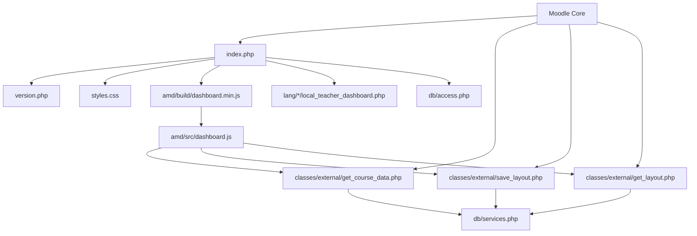

# File Structure - Teacher Dashboard Plugin

## Índice

- [1. Estructura General](#1-estructura-general)
- [2. Archivos Raíz](#2-archivos-raíz)
- [3. Directorio `/amd/`](#3-directorio-amd)
- [4. Directorio `/classes/`](#4-directorio-classes)
- [5. Directorio `/db/`](#5-directorio-db)
- [6. Directorio `/lang/`](#6-directorio-lang)
- [7. Directorio `/doc/`](#7-directorio-doc)
- [8. Archivos de Configuración](#8-archivos-de-configuración)
- [9. Dependencias y Relaciones](#9-dependencias-y-relaciones)
- [10. Archivos de Desarrollo](#10-archivos-de-desarrollo)

---

## 1. Estructura General

```
local/teacher_dashboard/
├── 📄 index.php                           # Página principal del dashboard
├── 📄 version.php                         # Metadatos y versión del plugin
├── 📄 styles.css                          # Estilos principales
├── 📄 test_working_drag.html              # Test de drag & drop (desarrollo)
├── 📁 amd/                                # JavaScript AMD modules
│   ├── 📁 src/
│   │   └── 📄 dashboard.js                # Código fuente JavaScript
│   └── 📁 build/
│       └── 📄 dashboard.min.js            # Código compilado/minificado
├── 📁 classes/                            # PHP classes del plugin
│   └── 📁 external/
│       ├── 📄 get_course_data.php         # External function para datos de cursos
│       ├── 📄 save_layout.php             # External function para guardar configuración
│       └── 📄 get_layout.php              # External function para cargar configuración
├── 📁 db/                                 # Definiciones de base de datos
│   ├── 📄 access.php                      # Capabilities del plugin
│   └── 📄 services.php                    # Registro de external functions
├── 📁 lang/                               # Archivos de idioma
│   ├── 📁 en/
│   │   └── 📄 local_teacher_dashboard.php # Strings en inglés
│   └── 📁 ca/
│       └── 📄 local_teacher_dashboard.php # Strings en catalán
└── 📁 doc/                                # Documentación
    ├── 📄 PLUGIN_SPECIFICATION.md         # Especificación completa
    ├── 📄 DRAG_DROP_PROBLEMS.md           # Problemas de drag & drop
    ├── 📄 AJAX_COURSE_DATA.md             # Guía AJAX
    ├── 📄 IMPLEMENTATION_GUIDE.md         # Guía de implementación
    ├── 📄 ARCHITECTURE_OVERVIEW.md        # Overview de arquitectura
    └── 📄 FILE_STRUCTURE.md               # Este documento
```

---

## 2. Archivos Raíz

### 2.1 index.php
**Propósito:** Página principal del dashboard, punto de entrada para usuarios
**Tipo:** HTML/PHP híbrido
**Responsabilidades:**
- Authentication y capability checking
- Estructura HTML del dashboard
- Carga de CSS y JavaScript
- Integración con sistema de temas de Moodle

**Estructura interna:**
```php
<?php
// Moodle integration
require_once('../../config.php');

// Security checks
require_login();
$context = context_system::instance();
require_capability('local/teacher_dashboard:view', $context);

// Teacher verification
$is_teacher = verify_teacher_role($USER);

// Page setup
$PAGE->set_context($context);
$PAGE->set_url(new moodle_url('/local/teacher_dashboard/index.php'));
$PAGE->requires->css('/local/teacher_dashboard/styles.css');
$PAGE->requires->js_call_amd('local_teacher_dashboard/dashboard', 'init');

// HTML output
echo $OUTPUT->header();
?>
<div id="teacher-dashboard">
    <!-- Dashboard structure -->
</div>
<?php
echo $OUTPUT->footer();
```

**Dependencias:**
- `../../config.php` (Moodle core)
- `styles.css`
- `amd/build/dashboard.min.js`
- Language strings

### 2.2 version.php
**Propósito:** Metadatos del plugin para sistema de instalación de Moodle
**Tipo:** PHP configuration
**Contenido:**
```php
<?php
defined('MOODLE_INTERNAL') || die();

$plugin->version   = 2025012200;        # YYYYMMDDXX format
$plugin->requires  = 2020061500;        # Moodle 3.9 minimum
$plugin->component = 'local_teacher_dashboard';
$plugin->maturity  = MATURITY_STABLE;
$plugin->release   = '1.0.0';
```

### 2.3 styles.css
**Propósito:** Estilos CSS para toda la interfaz del dashboard
**Tipo:** CSS stylesheet
**Organización:**
```css
/* === BASE STYLES === */
/* Estilos fundamentales y variables */

/* === LAYOUT COMPONENTS === */
/* Grid, flexbox, estructura general */

/* === INTERACTIVE ELEMENTS === */
/* Botones, forms, elementos clickables */

/* === DRAG & DROP STATES === */
/* Estados visuales para drag & drop */

/* === RESPONSIVE === */
/* Media queries para diferentes pantallas */
```

**Características:**
- CSS Grid para layout principal
- Flexbox para componentes
- Variables CSS para consistencia
- Media queries responsive
- Estados de drag & drop

### 2.4 test_working_drag.html
**Propósito:** Archivo de testing para validar drag & drop funcionando
**Tipo:** HTML standalone
**Estado:** Development/testing only
**Función:** Validar que el drag & drop funciona en aislamiento sin interferencias

---

## 3. Directorio `/amd/`

### 3.1 Estructura AMD
```
amd/
├── src/
│   └── dashboard.js          # Source code
└── build/
    └── dashboard.min.js      # Compiled/minified
```

### 3.2 /amd/src/dashboard.js
**Propósito:** Código fuente JavaScript principal del dashboard
**Tipo:** AMD module
**Responsabilidades:**
- Inicialización del dashboard
- Sistema drag & drop jerárquico
- Comunicación AJAX con backend
- Gestión de estado del cliente
- Event handling y DOM manipulation

**Estructura interna:**
```javascript
define(['jquery', 'core/ajax'], function($, Ajax) {
    'use strict';
    
    var initialized = false;
    var elements = {};
    
    // Public API
    return {
        init: function() {
            if (initialized) return;
            initialized = true;
            
            cacheElements();
            setupEventHandlers();
            setupDragAndDrop();
            loadLayout();
            refreshMoodleData();
        }
    };
    
    // Private functions
    function cacheElements() { /* ... */ }
    function setupEventHandlers() { /* ... */ }
    function setupDragAndDrop() { /* ... */ }
    // ... más funciones
});
```

**Funciones principales:**
- `init()`: Punto de entrada principal
- `cacheElements()`: Cache de referencias DOM
- `setupEventHandlers()`: Event listeners estáticos
- `setupDragAndDrop()`: Sistema drag & drop
- `loadLayout()`: Cargar configuración guardada
- `refreshMoodleData()`: Obtener datos de cursos
- `saveCompleteConfiguration()`: Persistir configuración

### 3.3 /amd/build/dashboard.min.js
**Propósito:** Versión compilada y minificada del JavaScript
**Tipo:** Compiled AMD module
**Proceso:** Normalmente generado automáticamente por Moodle, pero en este proyecto se actualiza manualmente debido a limitaciones de cache.
**Nota:** Debe mantenerse sincronizado con `src/dashboard.js`

---

## 4. Directorio `/classes/`

### 4.1 Estructura Classes
```
classes/
└── external/
    ├── get_course_data.php
    ├── save_layout.php
    └── get_layout.php
```

### 4.2 /classes/external/get_course_data.php
**Propósito:** External API function para obtener datos de cursos
**Tipo:** PHP External Function
**Namespace:** `local_teacher_dashboard\external`

**Estructura:**
```php
<?php
namespace local_teacher_dashboard\external;

use external_api;
use external_function_parameters;
use external_value;
use external_single_structure;

class get_course_data extends external_api {
    
    public static function execute_parameters() {
        return new external_function_parameters([]);
    }
    
    public static function execute() {
        // Business logic
    }
    
    public static function execute_returns() {
        return new external_single_structure([
            'all_courses' => new external_value(PARAM_RAW, 'JSON course data')
        ]);
    }
}
```

**Responsabilidades:**
- Validar permisos de usuario
- Obtener cursos donde el usuario es teacher
- Filtrar y formatear datos de cursos
- Retornar JSON con información de cursos

### 4.3 /classes/external/save_layout.php
**Propósito:** External API function para guardar configuración del dashboard
**Tipo:** PHP External Function

**Responsabilidades:**
- Validar datos de configuración
- Sanitizar entrada JSON
- Guardar en user preferences
- Manejar errores de persistencia

**Parámetros:**
- `layoutdata`: JSON string con configuración completa

### 4.4 /classes/external/get_layout.php
**Propósito:** External API function para recuperar configuración guardada
**Tipo:** PHP External Function

**Responsabilidades:**
- Recuperar configuración de user preferences
- Validar formato de datos
- Manejar casos de configuración no existente
- Retornar configuración o defaults

---

## 5. Directorio `/db/`

### 5.1 Estructura DB
```
db/
├── access.php         # Capability definitions
└── services.php       # External function registration
```

### 5.2 /db/access.php
**Propósito:** Definición de capabilities del plugin
**Tipo:** PHP configuration array

**Contenido:**
```php
<?php
$capabilities = array(
    'local/teacher_dashboard:view' => array(
        'captype' => 'read',
        'contextlevel' => CONTEXT_SYSTEM,
        'archetypes' => array(
            'editingteacher' => CAP_ALLOW,
            'teacher' => CAP_ALLOW,
            'manager' => CAP_ALLOW
        )
    )
);
```

**Capabilities definidas:**
- `local/teacher_dashboard:view`: Permiso para acceder al dashboard

### 5.3 /db/services.php
**Propósito:** Registro de external functions para AJAX
**Tipo:** PHP configuration array

**Contenido:**
```php
<?php
$functions = array(
    'local_teacher_dashboard_get_course_data' => array(
        'classname'   => 'local_teacher_dashboard\external\get_course_data',
        'methodname'  => 'execute',
        'description' => 'Get course data for teacher dashboard',
        'type'        => 'read',
        'ajax'        => true,
        'loginrequired' => true,
    ),
    'local_teacher_dashboard_save_layout' => array(
        'classname'   => 'local_teacher_dashboard\external\save_layout',
        'methodname'  => 'execute',
        'description' => 'Save dashboard layout configuration',
        'type'        => 'write',
        'ajax'        => true,
        'loginrequired' => true,
    ),
    'local_teacher_dashboard_get_layout' => array(
        'classname'   => 'local_teacher_dashboard\external\get_layout',
        'methodname'  => 'execute',
        'description' => 'Get saved dashboard layout',
        'type'        => 'read',
        'ajax'        => true,
        'loginrequired' => true,
    )
);
```

---

## 6. Directorio `/lang/`

### 6.1 Estructura Lang
```
lang/
├── en/
│   └── local_teacher_dashboard.php
└── ca/
    └── local_teacher_dashboard.php
```

### 6.2 /lang/en/local_teacher_dashboard.php
**Propósito:** Strings de idioma en inglés
**Tipo:** PHP language strings array

**Contenido:**
```php
<?php
$string['pluginname'] = 'Teacher Dashboard';
$string['dashboard_title'] = 'Teacher Dashboard';
$string['access_denied'] = 'Access denied. You must be a teacher to access this dashboard.';
// ... más strings
```

### 6.3 /lang/ca/local_teacher_dashboard.php
**Propósito:** Strings de idioma en catalán
**Tipo:** PHP language strings array

**Uso:** Traducción catalana de todos los strings del plugin

---

## 7. Directorio `/doc/`

### 7.1 Estructura Documentación
```
doc/
├── PLUGIN_SPECIFICATION.md      # Especificación completa
├── DRAG_DROP_PROBLEMS.md         # Análisis problemas drag & drop
├── AJAX_COURSE_DATA.md           # Guía sistema AJAX
├── IMPLEMENTATION_GUIDE.md       # Guía implementación
├── ARCHITECTURE_OVERVIEW.md      # Overview arquitectura
└── FILE_STRUCTURE.md             # Este documento
```

### 7.2 Propósito de cada documento:

**PLUGIN_SPECIFICATION.md:**
- Especificación técnica completa
- Índice detallado con todos los aspectos
- Documentación de funcionalidades
- Guía de instalación y configuración

**DRAG_DROP_PROBLEMS.md:**
- Análisis completo de problemas encontrados
- Soluciones implementadas
- Patrones correctos de implementación
- Prevención de problemas futuros

**AJAX_COURSE_DATA.md:**
- Guía completa del sistema AJAX
- External API functions
- Integración con Moodle
- Ejemplos de código

**IMPLEMENTATION_GUIDE.md:**
- Guía de implementación técnica
- Arquitectura de componentes
- Patrones utilizados
- Testing strategy

**ARCHITECTURE_OVERVIEW.md:**
- Visión general de la arquitectura
- Principios de diseño
- Decisiones arquitectónicas
- Escalabilidad y evolución

**FILE_STRUCTURE.md:**
- Estructura completa de archivos
- Propósito de cada archivo
- Dependencias entre archivos
- Organización del proyecto

---

## 8. Archivos de Configuración

### 8.1 Archivos de Configuración Moodle

**version.php:**
- Versión del plugin
- Compatibilidad con Moodle
- Metadatos del plugin

**db/access.php:**
- Capabilities del plugin
- Permisos por roles
- Contextos de aplicación

**db/services.php:**
- External functions
- Configuración AJAX
- Parámetros de seguridad

### 8.2 Archivos de Configuración Desarrollo

**test_working_drag.html:**
- Test independiente drag & drop
- Validación de funcionalidad
- Debugging aid

---

## 9. Dependencias y Relaciones

### 9.1 Diagrama de Dependencias



### 9.2 Dependencias Externas

**Moodle Core APIs:**
- `require_login()`
- `context_system::instance()`
- `require_capability()`
- `enrol_get_users_courses()`
- `get_user_preference()`
- `set_user_preference()`

**JavaScript Dependencies:**
- `jquery` (AMD module)
- `core/ajax` (Moodle AJAX wrapper)

**CSS Dependencies:**
- Moodle theme CSS (inherited)
- Grid and Flexbox support

### 9.3 Relaciones Funcionales

**Frontend → Backend:**
```
dashboard.js → AJAX calls → External functions → Moodle APIs → Database
```

**Configuration Flow:**
```
User Action → DOM Changes → JavaScript → AJAX → save_layout.php → User Preferences
```

**Data Flow:**
```
Page Load → get_course_data.php → Course API → JSON Response → DOM Update
```

---

## 10. Archivos de Desarrollo

### 10.1 Testing Files

**test_working_drag.html:**
- Standalone HTML test
- Validación drag & drop
- No dependencies on Moodle
- Used for debugging conflicts

### 10.2 Build Process

**AMD Compilation:**
```
src/dashboard.js → [Moodle Build Process] → build/dashboard.min.js
```

**Manual Sync (Current):**
```
src/dashboard.js → [Manual Copy] → build/dashboard.min.js
```

### 10.3 Development Workflow

**1. JavaScript Development:**
- Edit `amd/src/dashboard.js`
- Manually sync to `amd/build/dashboard.min.js`
- Test in browser
- Clear Moodle cache if needed

**2. PHP Development:**
- Edit external functions in `classes/external/`
- Purge Moodle cache
- Test AJAX calls

**3. CSS Development:**
- Edit `styles.css`
- Browser refresh
- Test responsive behavior

**4. Configuration Changes:**
- Edit `db/access.php` or `db/services.php`
- Upgrade plugin via Moodle admin
- Test new capabilities/functions

---

## Resumen de Archivos por Función

### 🎯 Core Functionality
- `index.php` - Entry point
- `amd/src/dashboard.js` - Main logic
- `styles.css` - Presentation

### 🔧 Backend Services  
- `classes/external/get_course_data.php` - Course data
- `classes/external/save_layout.php` - Save config
- `classes/external/get_layout.php` - Load config

### ⚙️ Configuration
- `version.php` - Plugin metadata
- `db/access.php` - Permissions
- `db/services.php` - API registration

### 🌍 Internationalization
- `lang/en/local_teacher_dashboard.php` - English
- `lang/ca/local_teacher_dashboard.php` - Catalan

### 📚 Documentation
- `doc/*.md` - Complete documentation set

### 🧪 Development
- `test_working_drag.html` - Testing aid
- `amd/build/dashboard.min.js` - Compiled output

Esta estructura de archivos está diseñada para seguir las convenciones de Moodle mientras mantiene una organización clara y lógica para facilitar el desarrollo y mantenimiento del plugin.